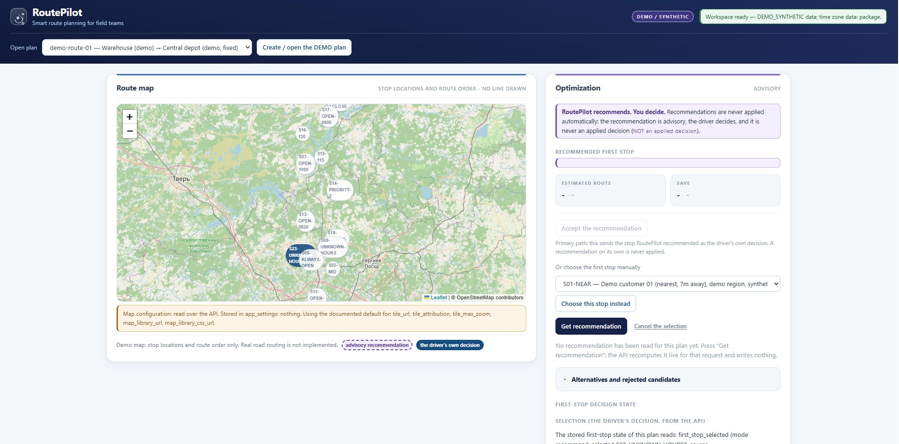
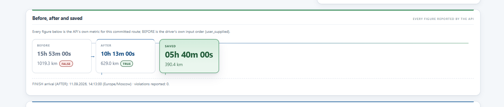
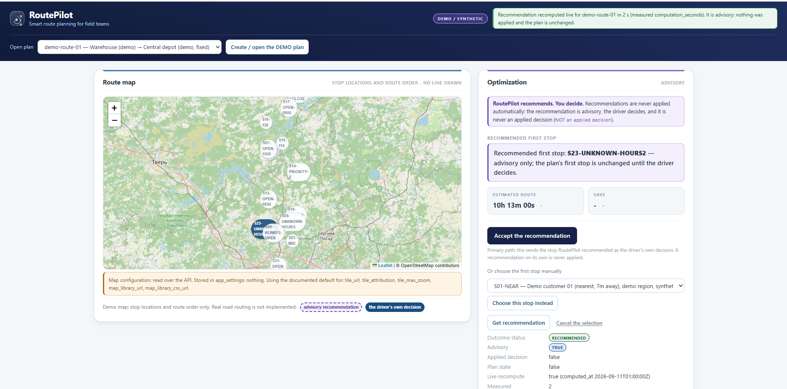

# RoutePilot

**Smart route planning for field teams, couriers and service workflows.**

RoutePilot takes a driver's list of service stops — with customer time windows, priorities and one
working day — and works out a practical visiting order. It then answers the question that really
decides the day: **where should the route start?**

> **RoutePilot recommends. The driver decides.** A recommendation is never applied automatically.



*The local demo workspace, running on synthetic demo data.*

## The problem

Manual route planning for 30–100 stops is slow and easy to get wrong. The hard part is not "which
stop is nearest": it is **where to begin**. Starting at the nearest stop can leave the driver waiting
hours for customers to open, while starting further away can mean a customer with an early closing
time is never reachable at all. RoutePilot evaluates the **complete route** — every stop, in order,
including the final leg back to the finish point — for **every eligible starting stop**, then
recommends the best one and explains why in metrics the driver can check.

## Demo result



| Route | Duration | Distance |
|---|---|---|
| **BEFORE** — the driver's own stop order | 15h 53m | 1019.3 km |
| **AFTER** — the RoutePilot order | 10h 13m | 629.0 km |
| **SAVED** | **5h 40m** | **390.4 km** |

**These are SYNTHETIC DEMO metrics** from the demo workspace shown above. They come from a
deterministic demo dataset with invented stops, invented coordinates and invented opening hours —
they are **not** real road-routing results and must never be read as real-world savings. The figures
also depend on which first stop the driver selects, so a different choice produces different numbers;
the workspace always shows the values the API actually reports for the route in hand.

## Core features

- Multi-stop route planning for dozens of stops per day
- Hard customer time-window constraints, validated per stop
- **First-stop recommendation** over complete routes (every eligible candidate evaluated)
- **Manual first-stop selection** by the driver, at any time
- **Recommendation ≠ driver decision** — enforced in the domain and visible in the UI
- Route timeline: arrival (ETA), waiting, service start and duration, departure, lateness
- **BEFORE / AFTER / SAVED** metrics with the saved time and distance the API reports
- Rejected candidates reported with the exact stops that violate their hard windows
- Stop priority controls, plus disable and restore
- Immutable, append-only run history (read-only in the UI)
- SQLite persistence with an exact save/load round-trip
- HTTP / JSON API for every action
- Browser workspace (no build step) as the demo front end
- Leaflet map showing stop locations and route order
- Explicit synthetic demo mode, labelled everywhere
- Automated regression, integration and browser-DOM tests

## Recommendation workflow



1. **Open the demo plan** — the workspace loads stops, windows and the driver's own stop order.
2. **Request a recommendation** — every eligible start stop is optimized as a candidate and ranked by
   the **complete elapsed route duration** (travel + waiting + service, i.e. the finish time).
3. **Read it as advice, not a decision** — the panel states that nothing has been applied; the plan is
   unchanged and still *awaiting the driver's choice*.
4. **Inspect the alternatives** — the ranked top candidates with their complete-route metrics, plus the
   rejected candidates and the stops whose hard windows their route would miss.
5. **Decide** — accept the recommendation, or pick a different stop manually.
6. **Only then is it plan state** — the chosen stop is pinned with its provenance
   (`accepted_recommendation` or `manual_choice`), and the driver can cancel it again.
7. **Recalculate** — the committed route is computed and one immutable run row is recorded.

## Architecture

```
Browser UI            (HTML / CSS / vanilla JS, Leaflet map)
    ↓  HTTP + JSON
HTTP API              (stdlib http.server transport, JSON contracts, error mapping)
    ↓
Application layer     (framework-agnostic services: plans, selection, route, run history)
    ↓
Route optimization engine   (domain model, time/DST handling, optimizer, recommendation)
    ↕
SQLite storage        (plans, stops, immutable run history, settings)
```

The **optimization core is deliberately separated** from the UI, the API transport and persistence:

- `core/` imports **only the Python standard library** — no HTTP, no UI, no storage, no network. This
  is enforced by an automated import check, so the engine can be tested, replaced or scaled without
  touching the product surface.
- `storage/` and `api/` depend on `core/`; nothing in `core/` imports them. Repository interfaces are
  declared as plain Protocols inside `core/`, and implemented under `storage/`.
- `web/` is static HTML/CSS/JS served as bytes. It contains no business formula: every number, order
  and metric it displays is rendered from an API payload unchanged.

## Tech stack

- **Python** (standard library first; 3.11+, developed on 3.13)
- **SQLite** for persistence (stdlib `sqlite3`, versioned SQL migrations, no ORM)
- **HTML / CSS / vanilla JavaScript** for the workspace
- **Leaflet** + an OSM-compatible tile layer for the map (configured, never vendored)
- **HTTP / JSON API** on the standard library's `http.server`
- **Git / GitHub** for versioned, reviewable development
- **Automated tests**: unit, integration, end-to-end API tests and an executed browser-DOM harness

No frontend framework, npm, bundler or build step is required: the workspace is plain files served by
the same local Python process, and the whole project runs without any third-party package.

## Testing

- More than **1,000 automated tests** — the last full local run: **1,084 tests, OK** (17 skipped).
- The suite is fully **deterministic and offline**: no network, no browser, no external service, no
  paid API. It covers the domain and time layer (including strict DST edge cases), the optimizer,
  storage round-trips, the HTTP API contracts, and the workspace markup and wiring.
- A dedicated harness **executes the served front-end script** in a strict DOM stub driven by payloads
  recorded from the real API, so rendering exceptions and state bugs are caught without a browser.
- **Manual real-browser verification** complements the automated suite: the layout, the map tiles and
  the full click-through workflow were checked by hand in Chrome.

```bash
python -m unittest discover -s tests -t .    # the full suite
python tools/doctor.py                       # environment check
python -m api.serve                          # then open the printed URL
```

## Current limitations

Honest and deliberately explicit — this is a portfolio MVP, not a production dispatch system.

**Not implemented:**

- real road routing (no road network, no road geometry, no real distances)
- geocoding (no address → coordinates service)
- live traffic
- turn-by-turn navigation
- multi-user authentication (the local API is loopback-only and unauthenticated)
- production deployment (it runs as a single local process)
- active-trip reoptimization (re-planning after a stop has been served)

The **map shows stop locations and route order only**. It draws no line between stops and does not
fabricate road geometry: no turn instructions, no road distance and no travel-time claims come from
the map. All travel times and distances are **synthetic demo values**.

The exhaustive first-stop recommendation is computed synchronously, and at the ~50-stop scale it takes
a few seconds — an accepted MVP limitation that is reported honestly as a measured value rather than
hidden behind a filter that would silently skip candidates.

## My role / AI-assisted development

This project was built as a portfolio piece to show product thinking and engineering discipline, not
to claim hand-written mastery of every line.

> Implementation was created with extensive use of AI coding tools, while product decisions,
> requirements, validation and final acceptance were managed manually.

My work included:

- product concept, target users and the core "recommend, don't decide" principle
- requirements and business workflow design
- architecture and technology decisions (pure optimization core, storage and API boundaries)
- stage decomposition, scope control and acceptance criteria
- edge-case analysis (hard time windows, DST gaps, infeasible candidates, stale recommendations)
- an AI-assisted implementation workflow with independent review cycles on every work unit
- testing and regression verification, plus real-browser validation and debugging
- final acceptance of each stage against the written specification

## Documentation

Deeper material lives in the repository: [`docs/PRODUCT_SPEC_v2.md`](docs/PRODUCT_SPEC_v2.md) (the
current specification), [`docs/ARCHITECTURE.md`](docs/ARCHITECTURE.md),
[`docs/DECISIONS.md`](docs/DECISIONS.md) (the decision registry — including every limitation recorded
above), [`docs/STORAGE_SCHEMA.md`](docs/STORAGE_SCHEMA.md) and
[`docs/WORKFLOW.md`](docs/WORKFLOW.md). `docs/PRODUCT_SPEC.md` is the historical first specification,
kept unchanged for traceability.

**All shipped data is DEMO / SYNTHETIC** — not real addresses, not real opening hours, not real
routing and no traffic.
